# How to attend...

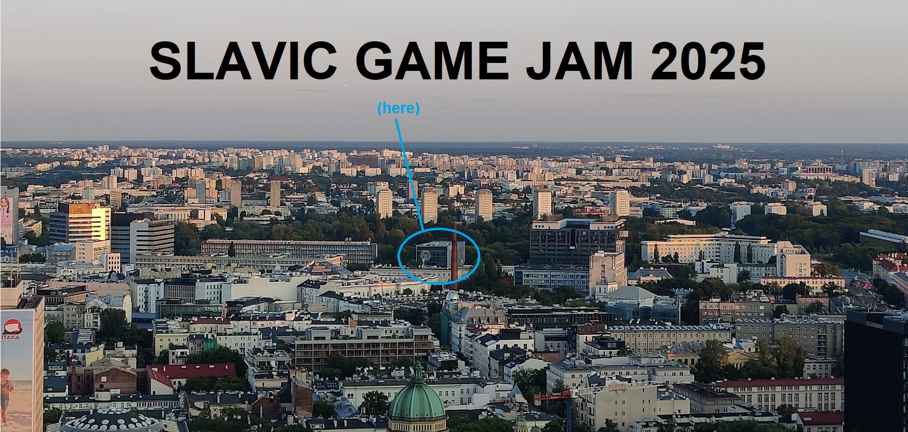

***Cześć!*** I'm Borb, an Oulu-based indie game developer (wishlist [EMUUROM](https://store.steampowered.com/app/1634360/EMUUROM/), etc, etc) and game jam enthusiast (join [Retro Game Jam 2025](https://itch.io/jam/retro-game-jam-2025) in Oulu!!).

Have you ever wanted to join a game jam abroad — maybe the biggest Polish game jam, the yearly [Slavic Game Jam](https://slavicgamejam.org/) in Warsaw — but don't know where to start? You're in luck: this is my personal-experience-based guide on *How to attend Slavic Game Jam 2025!*
* ***Note:*** If you happen to read this *after* SGJ 2025, the guide should be somewhat applicable for future SGJs as well.

### Pre-jam preparations

1. *a)* Buy the SGJ ticket or *b)* apply for the Slavic Game Jam scholarship, courtesy of Finnish Game Jam. If you're chosen as the ambassador, you get partial coverage for travel costs and a jam ticket in exchange for a travel report on the jam (it's the one you're reading right now.)
	* *(Optional)* Take someone to travel with! It's more fun that way, and as a bonus, you have someone to watch your luggage while you go to the bathroom at the airport.
2. *(Optional)* Book a hotel, especially if you intend to stay for longer in Warsaw, and doubly so if you don't want your possible non-jamming travel mate to sleep in the streets. (It is possible for jammers to sleep at the jamsite, in which case I recommend bringing an air bed, unless you *really* like sleeping on a bean bag.)
	* ***Sidenote:*** Ibis Warszawa Stare Miasto near the old town is an ok hotel, but do note that they do *not* have a fridge in the hotel room. Also, there are no open-late convenience stores nearby, but luckily there is a 24h *Swiat Alkoholi*, which is exactly what you think it is.
3. Join the SGJ Discord and read the FAQ.
4. Book flights / train / etc. If there happen to be strikes that affect Finnair, use airBaltic as a safety measure. You might even get to fly with their partner LOT Polish Airlines, which means you'll get a complimentary **blueberry bun** during the flight! 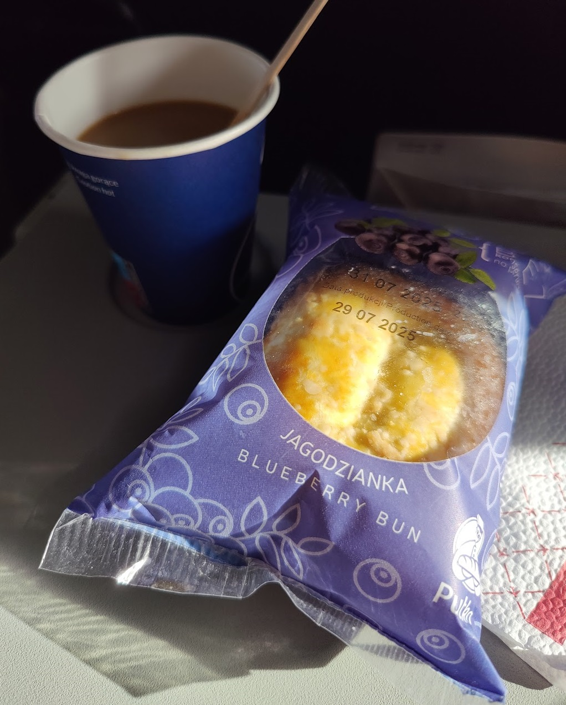
5. Travel to Warsaw by your chosen means of travel. 
	* ***Sidenote:*** Most likely, you will ***not*** need cash during the trip.
	- ***Sidenote:*** For easy acquisition of public transport tickets, install the *Jakdojade* app. A ticket can be bought there in advance, and it is only used when validated by scanning a QR code in a bus/tram.
6. Arrive in Warsaw a few days before the event, so you can join a local gamedev club [**Koło Naukowe Twórców Gier Polygon**](https://www.kntgpolygon.pl/) meetup at the gaming-themed H40S bar on Wednesday. You might find potential teammates already there, and more importantly, learn crucial info about local inside jokes. Be attentive the next day at 21:37! 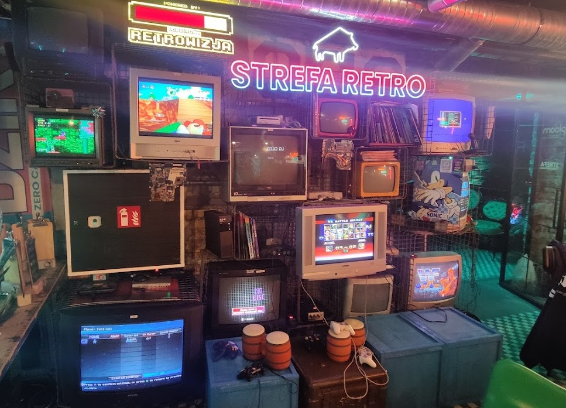
7. Join the preparty on Thursday at VooDoo Club with your plus one. The venue is split to a music and a non-music room, which makes socializing easier than in most gamedev bar evenings — if you didn't find teammates the day before, now's a new chance! At 21:37, witness the singalong of *Barka*, the favourite song of the Polish pope John Paul II. After that, dance your socks off to the eurobeat remix of *Säkkijärven polkka*.
8. *(Optional)* For the **authentic** Polish experience, go to the nearby gas station for a late night hot dog after the party.

### Friday, August 1

1. Arrive at Rektorska 4, the jam site of SGJ, around noon. 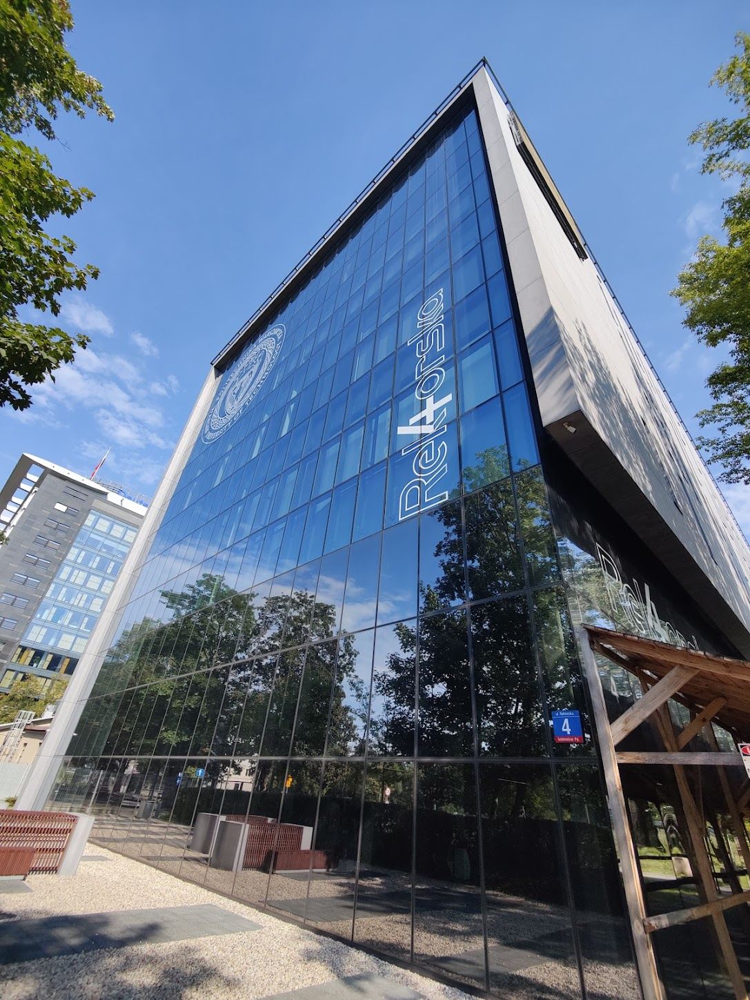
2. Get your cool new t-shirt! 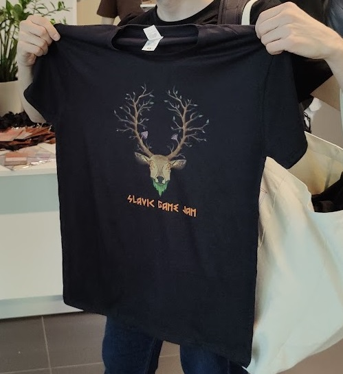 
3. Grab a sandwich! 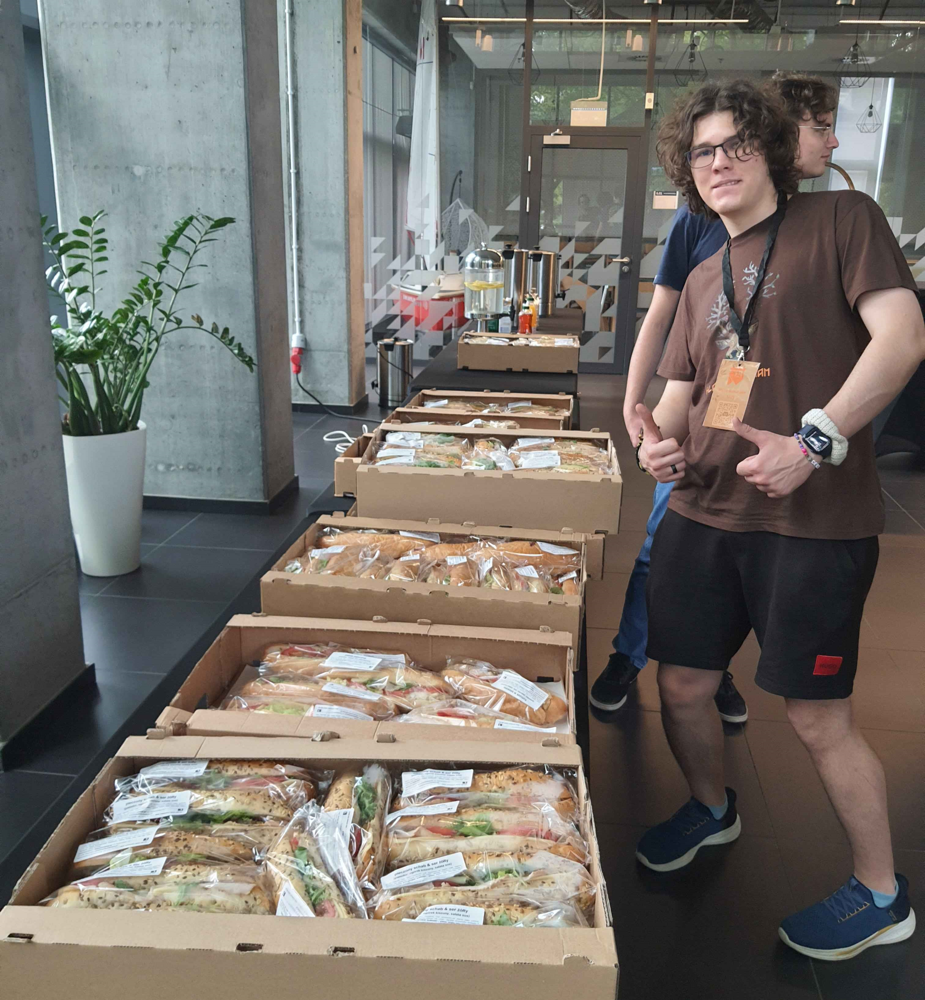
4. Find the teammates you already acquired (or find new ones)! Thanks to socializing with volunteers earlier, you might end up in a big team of six with Mienso, Rafał & Michał from Poland and Ozzy & Zey from Turkey.
5. At 13:00, join the jam kickoff where the theme is revealed (it is *Symbiosis*).
6. Get to know your teammates! As a team, choose your game specifications based on your team's skills, for instance a 2D game with Godot.
7. Take into account that if some of your teammates are also SGJ volunteers, some of their time will be used up by their duties. (In our case, it was Mienso and Ozzy.)
8. Start brainstorming! Having a lot of team members with lots of ideas is good, but at some point, you will have to start narrowing them down (the ideas, not the members). 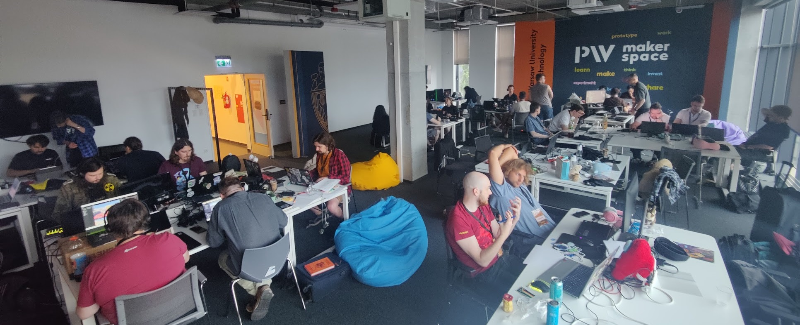
9. At 14:00, join Radosław Smyk's game ideation lecture. You will be reminded of the important lesson that generating ideas is only the beginning — you need to start *answering questions about your game design* to narrow down what kind of game you're making. (See the slides below!) 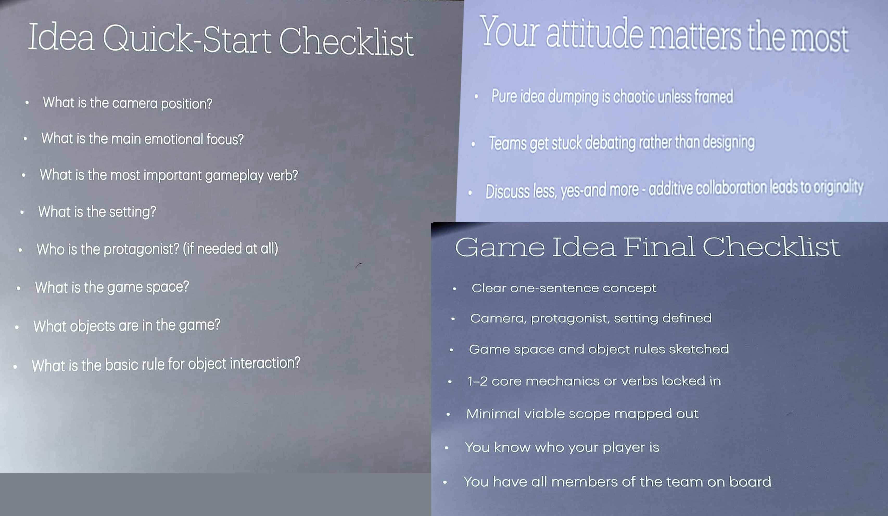
10. At 15:00, have a lunch! 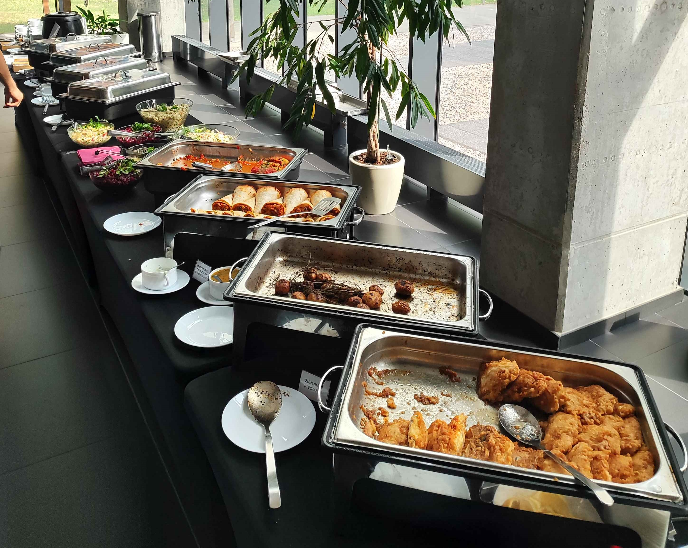
11. At 17:00, do not be alarmed when everyone on the streets stops in their tracks and cars start honking for one minute straight: It is a tradition of the [Warsaw Uprising Memorial Day](https://en.wikipedia.org/wiki/Warsaw_Uprising#Warsaw_Uprising_Memorial_Day).
12. At 20:00, have a dinner (it's pizza! Catering in this jam is plentiful to say the least.) 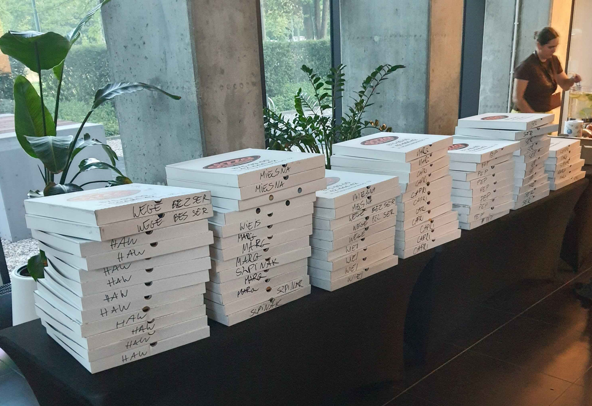
13. Keep working on your game until you have some basic mechanics implemented. If you happened to go with an idea of considerable technical complexity, realise that you might have to cut down many planned mechanics at some point. 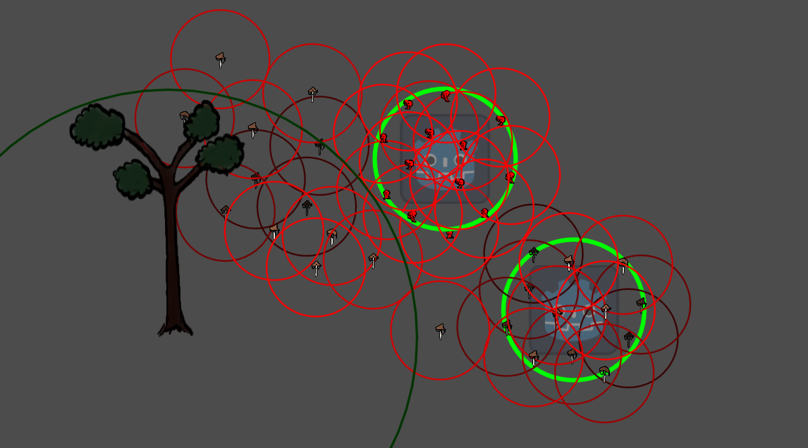
14. After calling it a day, have a good rest while you still can!

### Saturday, August 2

1. Arrive (or wake up) at the jam site early enough. You did arrive early enough, right...?
2. Have a sandwich and start jamming. In a 48h jam, the second jam day is when the most progress should be made (but don't panic if your game is still unfinished by the end of the day). 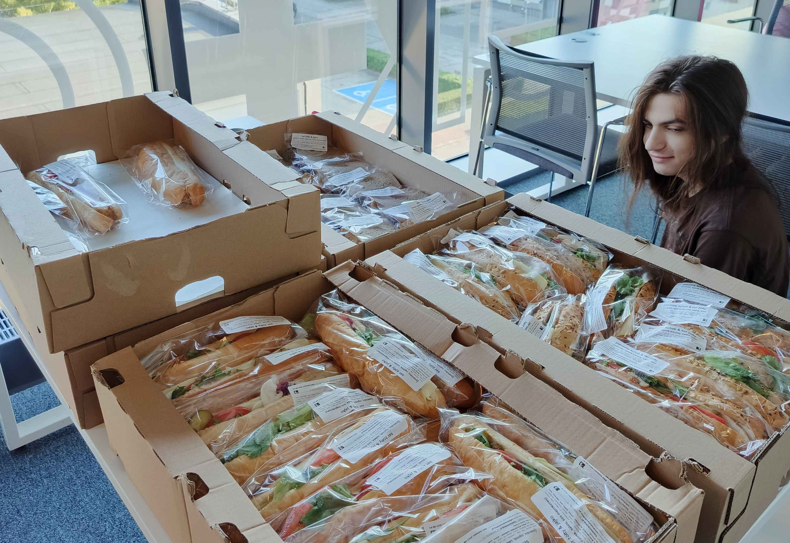
3. Realise you arrived too late to attend the testing & localization lecture at 12:00. Oops!
4. At 14:00, have a lunch!
5. *(Optional)* At the jam site, there are three rooms full of game jammers (150 to be exact!), so remember to visit other rooms to see how others are doing!
6. *(Optional)* Join the jam-adjacent Hyde Park activities (board games, playing games from previous SGJs, arranging pizza boxes creatively, karaoke...)
7. At 19:00, attend Marta Fijak's relatable lecture about *releasing your game without dying in the process*. 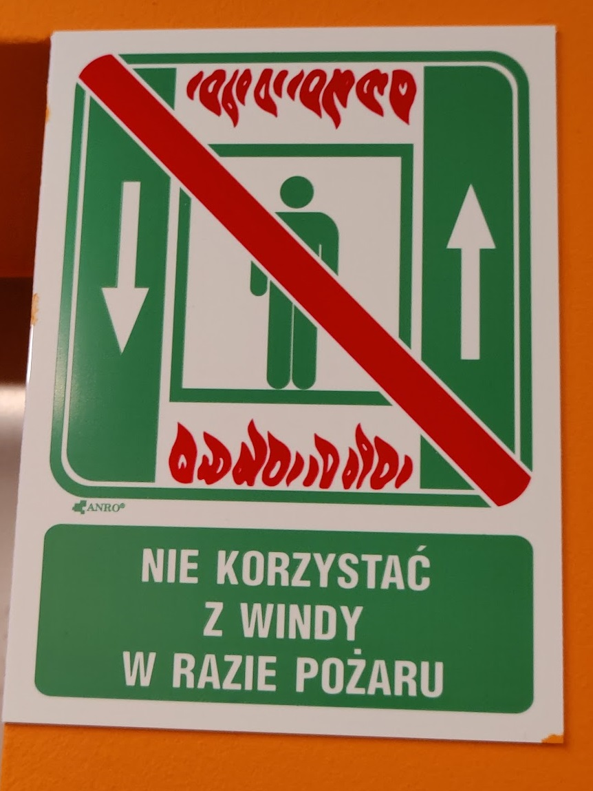 *(Pictured: A game developer in the process of releasing their game.)*
8. At 20:00, have dinner. (It's pizza!)
9. Panic because it's almost the end of the day and your game is largely unfinished.
10. Work on the game well into the small hours to have at least something playable tomorrow.
11. Make a thorough list of missing features and give yourself a pat on the back for using a GitHub issue tracker for the game.
12. Assign Mienso on a few issues before calling it a day so he knows what to work on during his volunteer night shift. 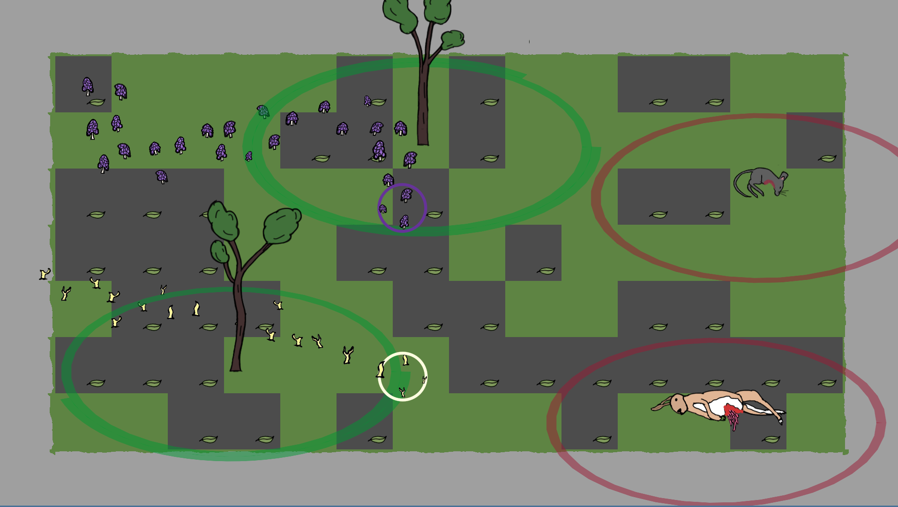
13. Go to sleep and do not count how many hours of sleep you have ahead of you.

### Sunday, August 3

1. Wake up MUCH earlier than yesterday so you have time to transform your prototype into an actual playable game.
2. Go to the jam site, eat breakfast, and start jamming furiously. Do not count how many hours there are left until the deadline at 13:30.
3. Start going through the to-do list, mark important tasks as **critical** and don't even touch the other tasks unless critical ones are already done. Communicate tirelessly with your teammates so that everyone is on the same page and working on critical tasks. 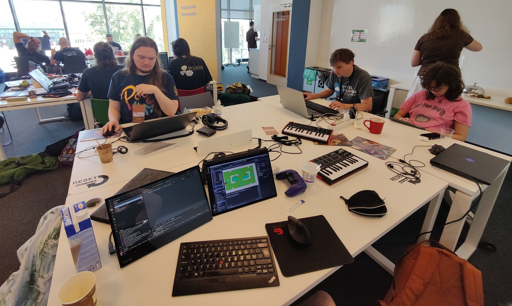
4. At 12:00, see the announcement that the deadline is actually at 13:00 because the jam started half an hour earlier than originally intended. Panic.
5. At 13:03, see a second announcement that the deadline is in fact at 13:30 as mentioned in the schedule. Panic less.
6. At 13:07, see a third announcement that the deadline is, or rather ***was*** at 13:00. Panic more!
7. At 13:22, see the final announcement: the deadline is still at 13:30 (as it should be in cases like these with conflicting pieces of information).
8. While all this is going down, make your game playable and remove any broken features.
9. Create an [itch.io page](https://kozcy.itch.io/infeshrooms) for the game and submit it to the jam.
10. At this point latest you should create a working build to be uploaded.
11. Notice that you never downloaded the Godot build tools needed for that. Start downloading...
12. Pray for the download to not stop at 90% for the second time.
13. Upload your successfully created build to itch.io. Take screenshots and upload a short gameplay video so it can be showcased in a montage.
14. It's 13:30. Somehow, you have a game that doesn't crash and has only a few bugs. Consider buying a lottery ticket and have lunch.
15. Take a short rest; you've earned it. 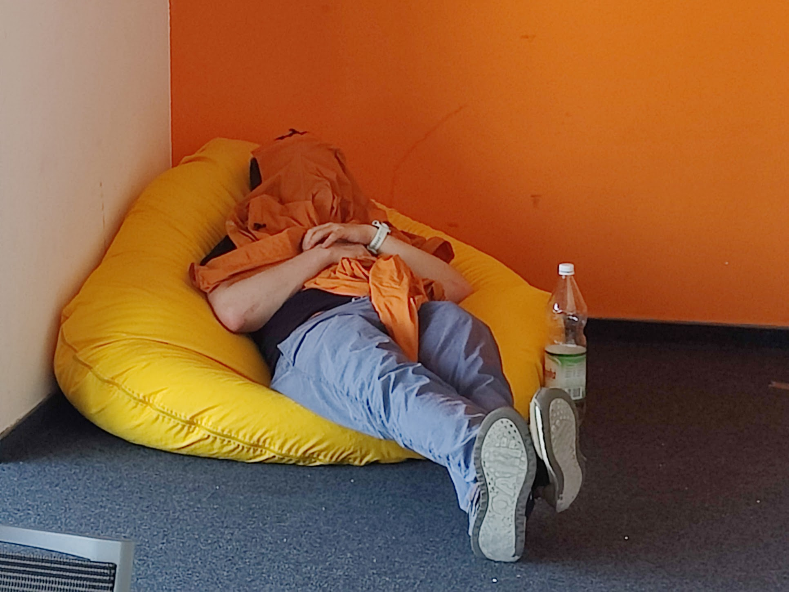
16. At 15:00, Join the closing ceremony. For a jam with 40 submissions, having individual presentations for all games isn't really feasible, so a montage of gameplay videos is a nice alternative.
17. Notice that your gameplay video never made it to the montage (you are promised later that the montage will be updated later and uploaded somewhere.)
18. ***Write playing instructions on paper***. Notice that you don't have enough controllers for your 4-player game so you will have to use three keyboards and one gamepad for playing. Eventually, borrow a second controller from another team and notice that your game doesn't support multiple controllers, so one controller plays with d-pad and another with ABXY.
19. At 15:30, start playing others' games in the showcase! Every 45 minutes, one of the three rooms is left empty so you don't have to worry *that much* about leaving your game unattended (and possibly unplayable without assistance). This seems like a good system, but the announcements that the 45 minutes are up are only posted on Discord, which are missed by a lot of people.
20. Notice that people are enjoying your mushroom territory game despite never having time to properly balance it. What?
21. Consider your jam a success! Remember to take a team picture! 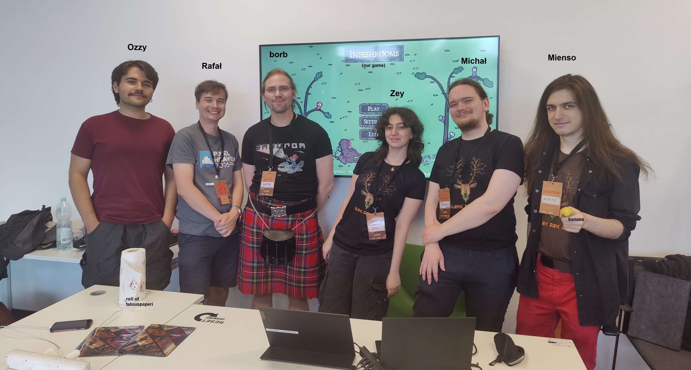
22. Thank volunteers for their hard work. 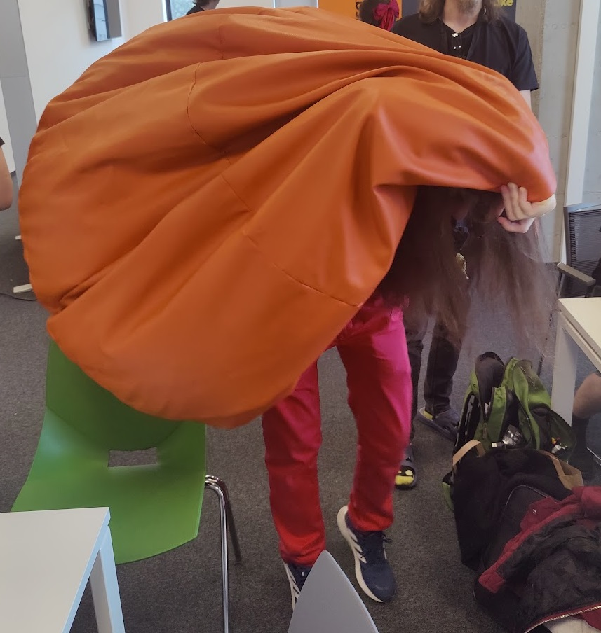
23. Join the afterparty in H40S! Remember to eat beforehand because there won't be enough pizzas for everyone. The attendance can surprise the organizers!
24. Talk with the organizers in the afterparty and thank them for a mostly very well organized jam, as there only were a few hiccups on the final day.

### After the jam

1. *(Optional)* Enjoy your stay in Warsaw with your travel partner for as long as you like — if you stay until the next Wednesday, you can go to the KNTG Polygon meetup for a second time!
2. *(Optional)* Remember to fill the jam feedback form.
3. *(Required if you got the scholarship)* Remember to write your travel report for FGJ in time so you don't have to do it right before the deadline. 

***I to by było na tyle!*** (That's all, folks!)

