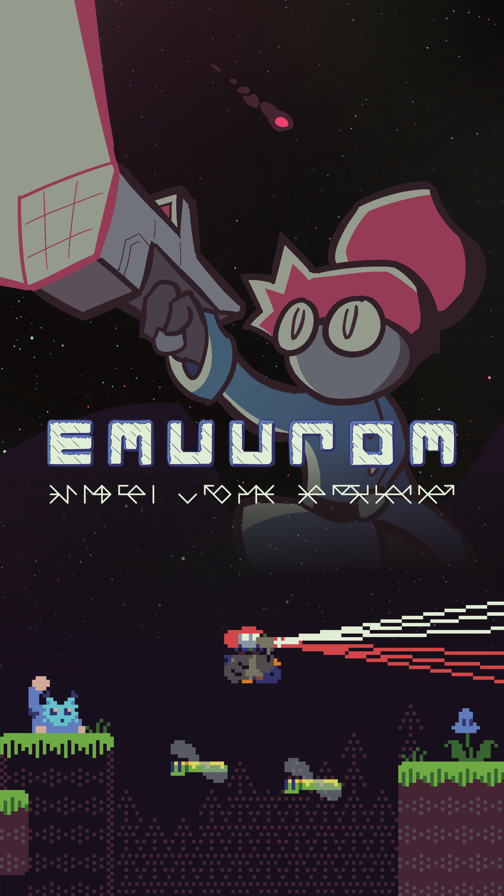
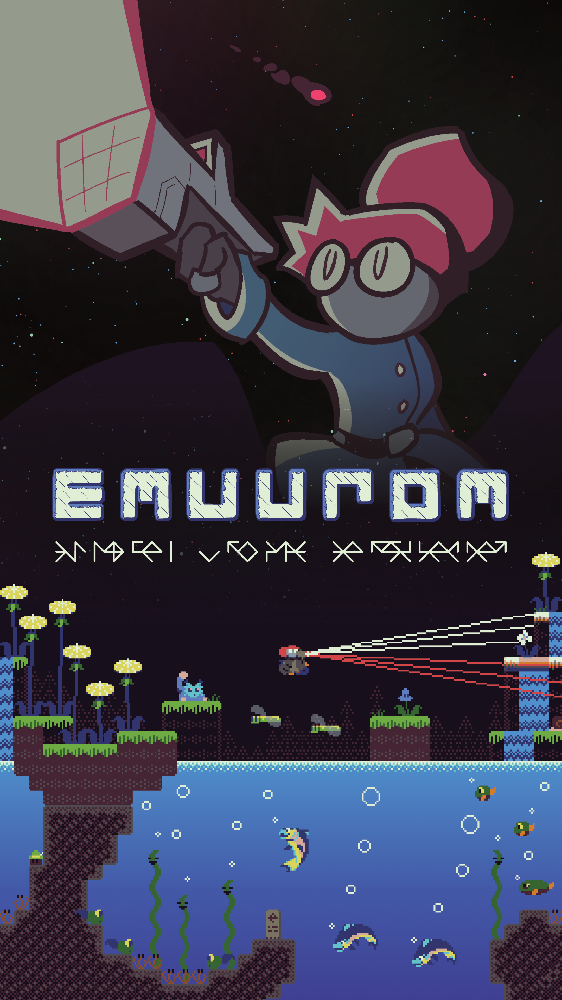
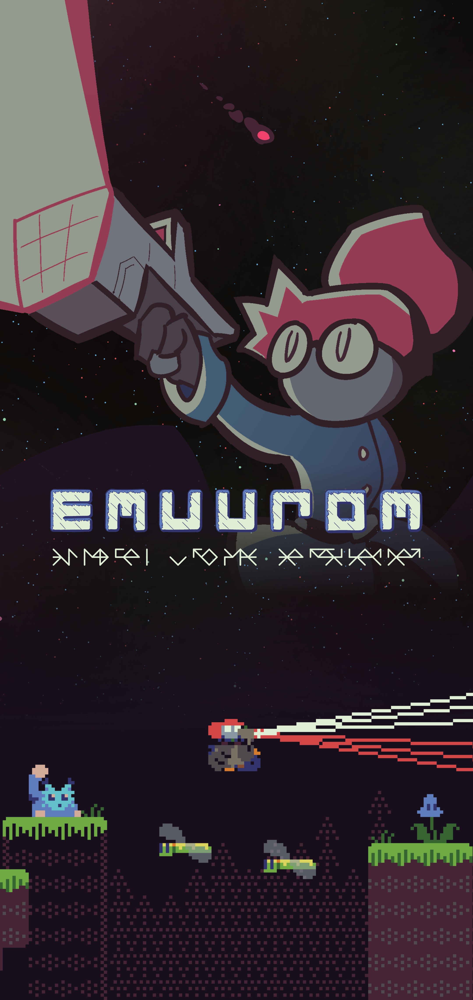
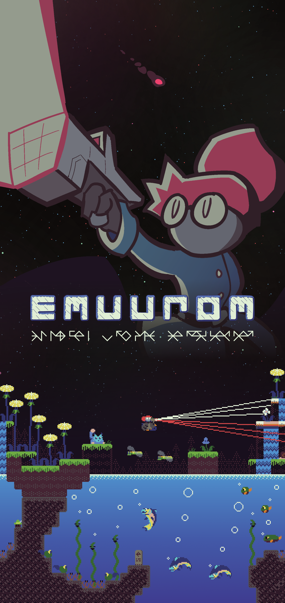
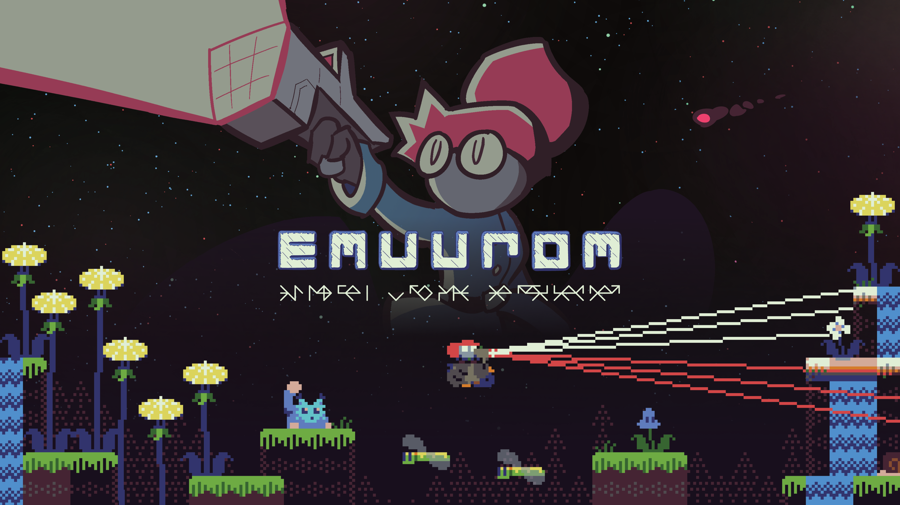

# FAQ

Answers to some common problems with EMUUROM.

* Where are the save files located?
	* Windows: `%APPDATA%\com.nesbox.tic\TIC-80\.local`
	* MacOS: `~/Library/Application Support/com.nesbox.tic/TIC-80/.local`
	* Linux: `~/.local/share/com.nesbox.tic/TIC-80/`
* PS5 Controller Dpad and Start button do not work
	* Steam version: Go to *View > Settings > Controller > General Controller Settings* and select PlayStation Configuration Support.
	* Itch.io version:
		* Using Steam is the easiest option with the Itch version as well: Add the game as a third-party application In Steam Library view, and in the lower left corner, click *Add a game > Add a non-Steam game*. Then, follow the instructions above.
		* Outside of Steam, there isn't a free single working solution afaik. For a partial solution, install [DualsenseX](https://dualsensex.com/) and set Controller Emulation to...
			* *Xbox 360:* Start button works, Dpad doesn't
			* *Dualshock4:* Both Start button and Dpad work, but Dpad is emulated as keyboard arrow key presses, so EMUUROM thinks you're using keyboard. Sigh...
	* The 8BitDo USB wireless adapter 2 adds Dpad support as well.
* The game's still not out?!
	* [Something here might help.](https://www.google.com/search?q=patience+motivational+quotes&sxsrf=AJOqlzWL5fnM2W3uhFFhFCrel5gyUd_Xqg:1679570693566&source=lnms&tbm=isch&sa=X&ved=2ahUKEwj5tMK0-PH9AhUG_SoKHes4Az4Q_AUoAXoECAEQAw&biw=1920&bih=942)
* I want wallpapers!
  * Sure!
  * [{: width="300" }](/images/wallpapers/emuurom-wallpaper-4k-portrait.png)
    [{: width="300" }](/images/wallpapers/emuurom-wallpaper-4k-portrait-water.png)
    [{: width="300" }](/images/wallpapers/emuurom-wallpaper-supertall-portrait.png)
    [{: width="300" }](/images/wallpapers/emuurom-wallpaper-supertall-portrait-water.png)
    [{: width="300" }](/images/wallpapers/emuurom-wallpaper-4k.png)