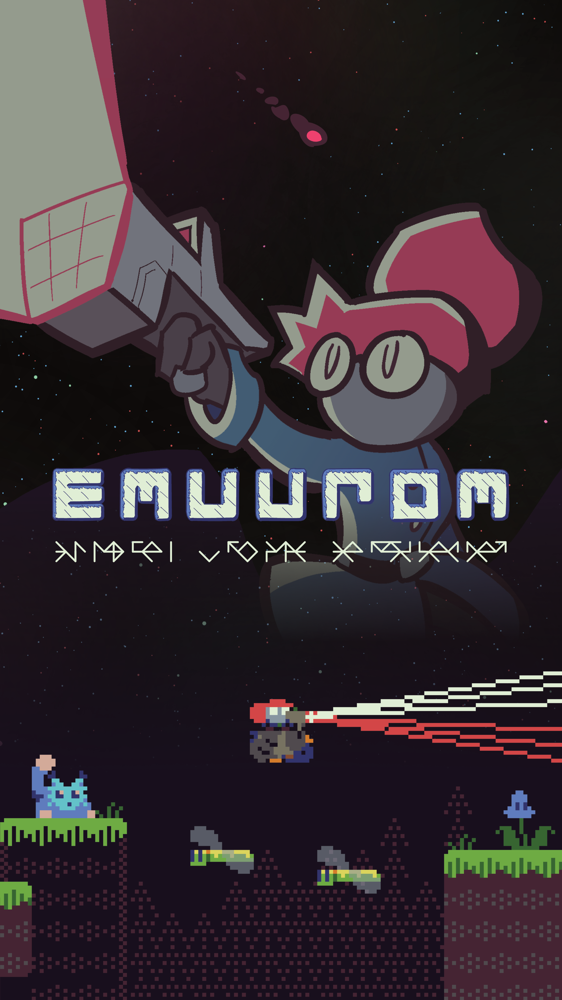
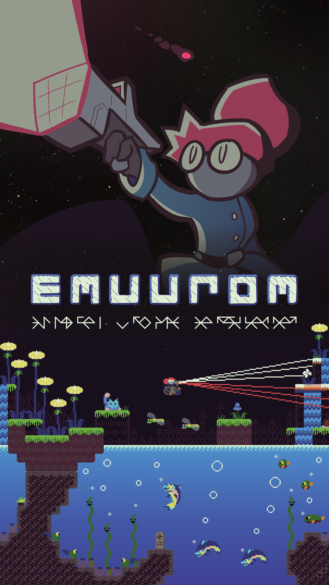
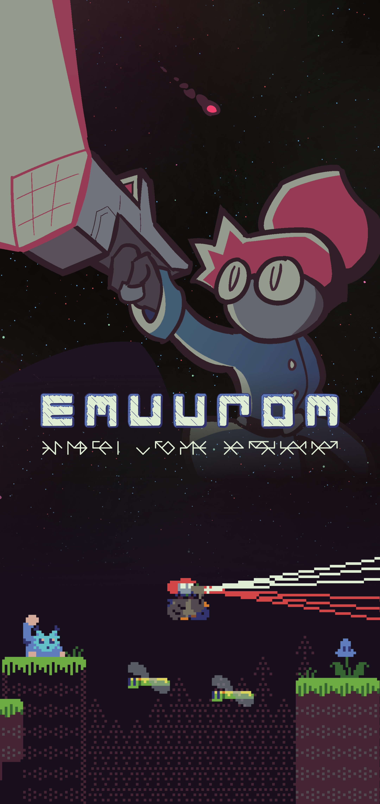
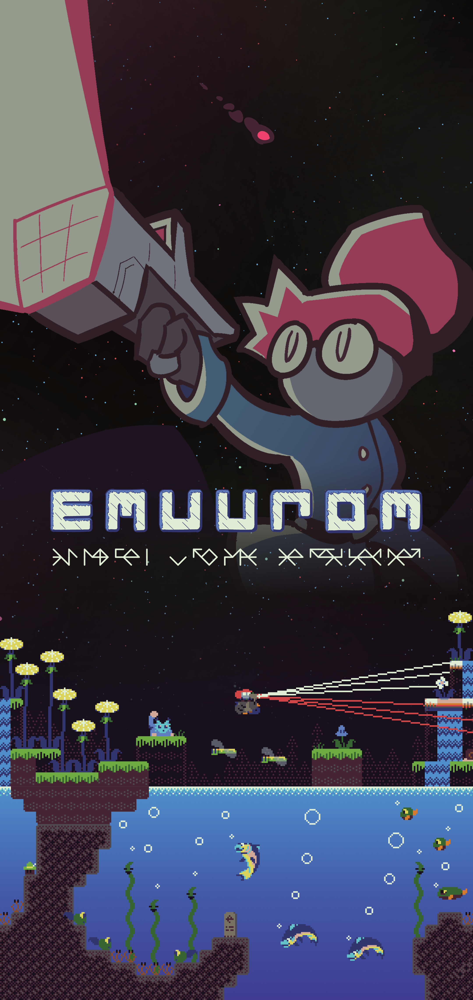
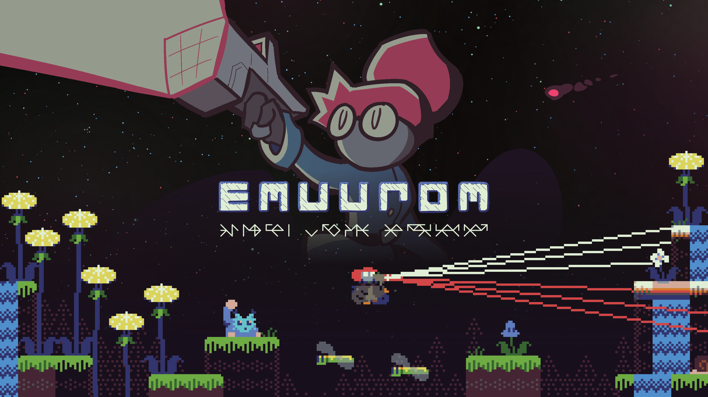

# FAQ

Answers to some common problems with EMUUROM.

* Where are the save files located?
	* The savefile is located in these folders:
		* Windows: `%APPDATA%\com.nesbox.tic\TIC-80\.local`
		* MacOS: `~/Library/Application Support/com.nesbox.tic/TIC-80/.local`
		* Linux: `~/.local/share/com.nesbox.tic/TIC-80/`
	* The savefile is just one file.
		* For the full game, it's `585a21a27ba3007b6fe573df269266b5`
		* For the demo, it's `6298572858a77413832ed3e104d64a2e`
		* For the playtest version, it's `bba9e9e9634d58cfff1338702b8714cc`
* If you are using a controller with a Nintendo layout, your buttons may act weird in EMUUROM.
  * To fix it, turn off *View > Settings > Controller > Advanced Settings > Use Nintendo Button Layout*
* PS5 Controller Dpad and Start button do not work
	* Steam version: Go to *View > Settings > Controller > General Controller Settings* and select *PlayStation Configuration Support*.
	* Itch.io version:
		* Using Steam is the easiest option with the Itch version as well: Add the game as a third-party application In Steam Library view, and in the lower left corner, click *Add a game > Add a non-Steam game*. Then, follow the instructions above.
		* Outside of Steam, there isn't a free single working solution afaik. For a partial solution, install [DualsenseX](https://dualsensex.com/) and set Controller Emulation to...
			* *Xbox 360:* Start button works, Dpad doesn't
			* *Dualshock4:* Both Start button and Dpad work, but Dpad is emulated as keyboard arrow key presses, so EMUUROM thinks you're using keyboard. Sigh...
	* The 8BitDo USB wireless adapter 2 adds Dpad support as well.
* I want wallpapers!
	* Sure!
		* [{: width="300" }](/images/wallpapers/emuurom-wallpaper-4k-portrait.png)
		[{: width="300" }](/images/wallpapers/emuurom-wallpaper-4k-portrait-water.png)
		[{: width="300" }](/images/wallpapers/emuurom-wallpaper-supertall-portrait.png)
		[{: width="300" }](/images/wallpapers/emuurom-wallpaper-supertall-portrait-water.png)
		[{: width="300" }](/images/wallpapers/emuurom-wallpaper-4k.png)